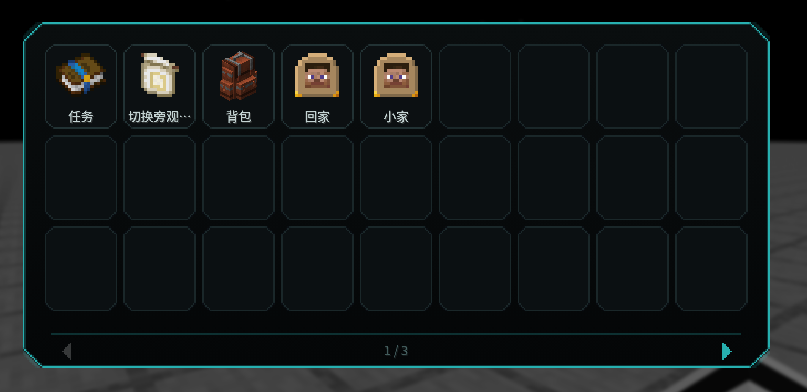

# SimpleQuickKeys

[English](README.md) | **中文**

> Minecraft **纯客户端**模组：一个快捷键呼出卡片式快捷功能面板，把常用功能、物品图标和指令集中到一处。
> 键盘按键不够用？模组给每个格子都准备了**独立的虚拟键**，可以把任意功能（含其它模组的功能）挂上去，由面板触发。

## 功能

- **单键呼出**：默认 `G` 开/关面板，`Esc` 关闭
- **卡片面板**：9 列 × 3 行，每页 27 格；底部箭头或滚轮翻页，共 **3 页 81 格**；窗口变小自动切换三档尺寸
- **物品图标**：任意物品作为图标；内置关键词搜索选择器（16×9 网格，滚动条可拖拽）
- **触发功能**：点击格子直接调用功能，**不依赖该功能是否绑定快捷键**；潜行 / 疾跑等长按功能自动变成开关（卡片亮青色并显示指示条）
- **快捷指令**：每格可填一条指令（如 `home`、`gamemode creative`），填了就优先执行；输入时提供与聊天栏一致的指令补全
- **独立虚拟键**：每格一个独立虚拟键，可把任意功能（含其它模组的功能）挂上去由面板触发 —— 键盘按键不够用时的解法
- **移动槽位**：底部「移动槽位」按钮：点两个格子即可互换内容，可连续移动，再点按钮退出
- **悬浮提示**：鼠标移到卡片上显示完整名称与触发方式
- **纯客户端**：单人/多人皆可，服务端无需安装

## 安装与使用

1. 从 [Releases 页面](https://github.com/TrZeal/Simple-Quick-Keys/releases) 下载对应你游戏版本的 jar
   （Forge 1.19.2 / Forge 1.20.1 / NeoForge 1.21.1，只放其中一个）
2. 放进 `.minecraft/mods/`
3. 启动游戏，按 **`G`** 打开面板
4. **左键**格子 → 触发功能；**右键**格子 → 编辑

编辑弹窗里可以改：**物品ID** · **名称** · **逻辑按键** · **快捷命令**

- 「选择图标」= 按关键词搜索物品
- 「选择键位」= 从游戏所有功能里挑一个
- 「清空格子」= 清空该格

底部 **`◀ 1/3 ▶`** 翻页；**「移动槽位」** 调整格子顺序。

## 配置

保存在 `config/key_panel/slots.json`（首次打开面板自动生成），可直接编辑或备份。

## 常见问题

**Q：点了格子没反应？**
A：该格子还没配置 —— 右键它，选图标 / 选键位 / 填指令。

**Q：某个功能点了没用？**
A：极少数功能无法被模拟（例如原版「截图」这类只响应真实按键的）。可到 Issues 反馈具体是哪个模组或功能。

**Q：快捷指令没生效？**
A：多人服务器上指令受权限限制（例如 `gamemode` 需要 OP）。

**Q：会破坏原版按键吗？**
A：不会。模组只在触发时临时改绑、用完立即还原，你自己按原来的键照常可用。

## 许可

[MIT License](LICENSE) —— 可自由使用、修改、再发布（保留版权声明即可）。

